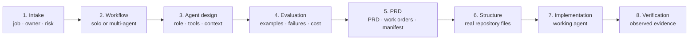

# Studio Standard Agent Framework

The Utopia Studio system for turning an agent idea into a **clear, buildable, and tested agent**.

It helps a person answer three questions:

1. What should this agent do?
2. What is the smallest safe way to build it?
3. What evidence must pass before we call it ready?

The framework connects the whole journey. It does not stop after writing a prompt or a PRD. It
carries confirmed decisions into the repository, implementation, and verification steps, and it
records a clear blocker when required information or evidence is missing.

## Start here

### Use the guided builder

The easiest path for a nontechnical user is the visual builder:

```bash
cd ui/agents-framework-ui
npm ci
npm run dev
```

Open the local URL, describe the job, name the owner, and answer the eight plain-language
questions. The builder recommends the smallest suitable path and produces a reviewable brief with
a visual PRD and work-order handoff.

The main page also lets you download the complete framework without completing the questionnaire.

### Use it as an installed skill

Build the portable bundle:

```bash
npm ci
npm run bundle
```

Upload `dist/studio-agent-framework.zip` to a compatible Agent Skills host, then ask:

> Build an agent that turns meeting notes into reviewed Linear issues.

Use the word **build** when you want the complete journey. Ask to **design**, **evaluate**, or
**write the PRD** only when you want that individual stage.

## What it produces

Every build starts a `build-state.json` carrier. It preserves the confirmed job, owner, risk,
runtime, permissions, memory choice, current stage, blockers, and paths to produced artifacts.

The full flow is:



| Step | What happens | Main output |
|---|---|---|
| Intake | Clarify the job, owner, users, risk, runtime, and authority | `build-state.json` |
| Workflow | Decide whether this is one agent or a bounded workflow | Workflow decision |
| Agent design | Define role, tools, context, identity, and optional memory | Agent specification |
| Evaluation | Define good results, failure cases, graders, and budget | Evaluation contract |
| PRD | Turn the decisions into an implementation handoff | PRD + work orders |
| Structure | Create the smallest correct repository profile | Skill, managed, or coded layout |
| Implementation | Build the approved work orders | Working deliverable |
| Verification | Run the generated agent's own checks | Evaluation and conformance results |

For coded agents, `agent-prd` also produces `agent-manifest.json`. The manifest is the
machine-checkable handoff from design to implementation. It records identity, permissions,
runtime pins, tools, memory, budgets, fixtures, and required proof checks.

## The four build paths

The framework chooses the lowest rung that can do the job safely:

| Rung | Use it when | Typical result |
|---|---|---|
| 1 · Skill | A person runs a repeatable set of instructions | Portable skill folder |
| 2 · Project | The work needs standing instructions and reference files | Shared project workspace |
| 3 · Managed surface | An existing platform can provide scheduling, approval, or visibility | Configured managed agent |
| 4 · Coded agent | The job needs its own loop, durable state, or consequential automation | Repository + runtime harness |

Memory and workflows are choices, not defaults. A simple reviewed skill should not inherit the
same cost and evidence burden as an autonomous production service.

## The eight skills

```text
learnings/         active rules learned from real failures; loaded first
agent-builder/     front door that routes and carries the complete build
workflow-design/   decides one agent versus a bounded workflow
agent-design/      defines role, tools, identity, context, and memory
eval-first-spec/   defines cases, graders, thresholds, autonomy, and cost
agent-prd/         produces the PRD, work orders, and coded-agent manifest
agent-structure/   creates and checks skill, managed, and coded layouts
mastra-harness/    implements approved coded work on Mastra + Convex
```

The shared lifecycle contract is
[`agent-structure/references/pipeline.md`](agent-structure/references/pipeline.md). Detailed runtime
responsibilities are in
[`agent-structure/references/runtime-contracts.md`](agent-structure/references/runtime-contracts.md).

## How verification works

The framework uses three result states:

- `passed`: all requested checks were observed and passed.
- `incomplete`: required checks or live evidence are still missing.
- `failed`: the declaration is invalid or an observed check failed.

Missing evidence never becomes a pass. Release mode exits unsuccessfully for both `incomplete`
and `failed` results.

Useful commands:

```bash
npm run check
npm test
npm run bundle

node harness/pipeline.js <agent-repo>/build-state.json
node harness/run.js --manifest=<agent-repo>/agent-manifest.json
node harness/structure.js --root=<agent-repo> --profile=<profile>
```

See [`harness/README.md`](harness/README.md) for actual-agent adapters, proof modules, and release
verification.

## What is proven today

Repository tests cover metadata, references, package structure, pipeline transitions, manifest
validation, scaffolds, the downloadable ZIP, and two generated-agent journeys:

- A simple stateless briefing agent.
- A resumable agent with workflow state and tenant-scoped memory.

Those examples run through repository validation, persisted stage handoffs, actual-agent fixtures,
completion checks, repeated deterministic runs, context changes, and simulated restart.

This is useful local and CI evidence. It does not certify live model quality, human evaluator
agreement, production Convex recovery, or every external provider's side-effect behaviour. Each
production agent must supply that evidence for its own runtime and integrations.

## Why both SQL and Convex appear

Mastra uses whichever storage adapter is configured. `LibSQLStore` writes SQL and `ConvexStore`
writes supported records to Convex. They are alternatives, not databases that synchronize with
one another.

The bake-off uses SQLite or LibSQL for explicit test configurations. Production Studio scaffolds
select Convex and fail when its configuration is missing. The domain event log remains separate
from mutable workflow snapshots.

## Credits

`agent-design`, `workflow-design`, and `eval-first-spec` originate from Ollie's Icarus pack and
include Studio integration wrappers so they participate in one tested pipeline. Rights and
attribution are recorded in [`docs/LICENSE-ICARUS.md`](docs/LICENSE-ICARUS.md).

`agent-builder`, `agent-prd`, `agent-structure`, `mastra-harness`, and `learnings` are Studio-owned.

---

## Detailed workflow and operational evidence

The sections below preserve earlier experiments. The current pipeline contract above controls
stage transitions, packaging, and proportional evidence when older examples differ.

## "Build" enters the pipeline. "Design" is one stage.

This is the single most common mistake, and it is not a bug in either skill.

| You type | You get | Because |
|---|---|---|
| "I want to **build** an agent that …" | `agent-builder` — intake, then the whole chain | Build = the pipeline |
| "**Design** an agent for …" | `agent-design` — one four-part spec, no chain | Design = stage 2, correctly |
| "**Design the fleet** / orchestrate the agents" | `workflow-design` — stage 1 only | Already self-routed |
| "**Spec the build** / how do we know it works" | `eval-first-spec` — stage 3 only | Already self-routed |
| "Write the **agent PRD**" | `agent-prd` — stage 4 only | Already self-routed |

If you want the chain, say **build**. If you say **design** and get one stage, the
router worked.

---

## What the chain actually asks first

Two beats before any design happens. Both are on the record; no later stage re-asks them.

**Beat 1 — Intake (5 questions).** What work, and what artefact for whom · has a human
done it by hand with real inputs and outputs · one agent or many · who builds and runs it
· what breaks if it's wrong.

**Beat 2 — The use beat (4 questions).** This is the one people skip, and it cannot be
skipped:

- **Runtime home** (HOME-1) — where the loop *executes* this week. Utopia OS, standalone
  Vercel, or local Claude/Codex/Cursor.
- **Talk surface** (HOME-1) — where a person or trigger *speaks to it*. OS UI, Slack,
  schedule, CLI. **This is a different answer from runtime home.** The same agent can run
  locally and be talked to on a schedule. Every PRD before this rule existed assumed
  Claude chat was both.
- **Who the tools act as** (ID-1) — studio shared Composio · named-team shared Composio ·
  the fellow's own Composio user · first-party API / service account. Never the studio
  Slack acting as a fellow. Writes on a shared connection need a named owner and a kill
  switch.
- **Context route** (CTX-2, CTX-2b) — invariant core preloaded, everything else pulled on
  demand. Prefetch into the log only when you already know you'll need it this run.

Answer honestly, especially "has a human done this by hand?" and "what breaks if it's
wrong?". The pipeline sets its depth from your answers, and a blocker firing is the
pipeline working, not failing.

---

## How to test it fully

Four tests. The first is two minutes; the last is the one that actually matters.

### 1 · Smoke table — does the router route?

Each row in a **fresh chat**. A loaded sibling skill changes routing behaviour (observed
17 Aug: "design the fleet" sent mid-conversation blended with the already-loaded
`agent-design` instead of routing). A contaminated run is **invalid**, not failed.

| # | Type this | Expect loaded | Pass looks like |
|---|---|---|---|
| S1 | "I want to build an agent that \<something you do by hand weekly\>" | `agent-builder` | Intake first — 5 questions batched 2–3 at a time, then the use beat |
| S2 | "Design an agent for \<same thing\>" | `agent-design` | One four-part spec. No chain. No intake. |
| S3 | "Design the fleet for \<a multi-step job\>" | `workflow-design` | Fleet-or-solo gate, spawn triggers with observable conditions |
| S4 | "Spec the build — how do we know it works?" | `eval-first-spec` | Golden cases + autonomy + cost, refuses to spec from nothing |
| S5 | "Write the agent PRD for \<X\>" | `agent-prd` | Asks for stages 1–3 artefacts first, offers to fill gaps |
| S6 | Any of the above | `learnings` also loaded | Rule IDs cited when something is blocked or waived |
| S7 | "Build an agent that writes haikus about our roadmap" | `agent-builder`, then **stops** | Wedge blocker fires before any config — nobody asked for this |

S7 is the important one. A chain that always finishes is broken.

### 2 · REPORT-1 on the beginner path

Run S1 with something small and real — a weekly task, nothing irreversible. Expect a
**low rung** (1 skill / 2 project / 3 managed) and a checklist, not a codebase spec. Most
Studio agents to date are rungs 1–3; climbing the ladder for status is the failure.

Then check the thing fast-pass gets wrong. Even on rungs 1–3 the run must still emit:

- [ ] the blocker (or an explicit "none")
- [ ] the rung, with the reason it was chosen
- [ ] the runtime home
- [ ] the talk surface
- [ ] the tool-identity row

A fast-pass that quietly completes without those five rows **fails REPORT-1**. That is
theatre, and it is a reportable bug — send it to Haniyah.

### 3 · Hermes — the eval harness

`agent-builder/hermes/` is the harness around the orchestrator: `rubric.json`
(5 dimensions × 0–5, pass ≥ 21, no dimension < 4), 9 golden cases, 5 adversarial cases
drawn from *observed* failures, and `RESULTS.md`. Round 1 (17 Aug 2026): **6 pass ·
1 partial · 0 fail**, 24/25 on the rubric.

Two rules transfer to every skill's harness, and Hermes doubles as the proposed general
eval standard for Studio skills — swap the cases, keep the structure:

1. **The judge is never the generator.** A separate Claude instance (or a human) scores,
   given the rubric + the case + the transcript. The instance that ran the chain never
   scores itself.
2. **Adversarial cases must attack the skill's *stated* kill lines.** A kill line with no
   case that can trip it is decoration.

Re-run cadence: full golden set on any skill edit · full set **twice** on every model
release, once with the skill loaded and once bare (if the bare model passes, that's a
deprecation flag) · after any live run that misbehaves, distil the failure into a new
adversarial case *before* fixing the skill, so the fix has a regression test.

Read `agent-builder/hermes/README.md` for the full judge protocol.

### 4 · STATE-1 kill-test — the one that matters

Only for rung 4 / Tier B–C builds, and it is not optional there. **Vendor runtime state
is a cache, not the source of truth.**

```
1. Start a run.
2. Kill it mid-run — hard. Not a graceful shutdown.
3. Start a FRESH process. New PID, no warm memory, no local state file available.
4. It must resume from the canonical append-only log ALONE.
```

If resume needs the harness's own state file, the design **fails** — LOOP-2 (durable log
outside the process) and STACK-1 (one source of truth). Not a warning; a fail.

Prove it by killing the process. That is a test, not a nice-to-have.

---

## The coded-agent standard: Mastra + Convex

**Mastra + ConvexStore is the Studio standard harness for Tier B/C coded agents.** Mastra
runs the agent loop; Convex holds the canonical, append-only, tenant-keyed event log and
business data. These are complementary roles, not competing choices.

This decision is based on the Mastra-on-Convex STATE-1a probe: a live Kimi K2.6 agent was
hard-killed with `SIGKILL`, then resumed in a fresh process from the remote Convex state
without a model re-fire or duplicate send. An independent process also read the suspended
state directly from Convex. See [`docs/bakeoff/findings-mastra.md`](docs/bakeoff/findings-mastra.md).

Mastra's default local/LibSQL state is **not** the approved production architecture. A
qualifying build uses `ConvexStore`, and it must still prove its own kill-and-fresh-process
recovery. The decision makes Mastra the Studio default; it does not claim Mastra is best in
every context.

An alternative harness requires a dated, evidence-backed waiver and must meet the same
STATE-1/STATE-1a requirements: canonical state in a tenant-keyed, externally queryable
store; hard-kill recovery in a fresh process; no duplicate external action.

### Decision record — 26 August 2026

**Decision:** Mastra + ConvexStore is the standard runtime harness for coded Tier B/C
Studio agents. **Evidence:** live-model hard-kill, fresh-process recovery, independent
Convex read-back, and no duplicate-send verification. **Review condition:** revisit this
default only when new evidence shows the standard no longer meets Studio requirements or a
candidate demonstrably meets them better under the same conformance suite.

Read the decision and Product Framework / future Utopia OS integration rationale in
[`docs/decisions/2026-08-26-mastra-convex-and-product-framework.md`](docs/decisions/2026-08-26-mastra-convex-and-product-framework.md).

**The W-01 waiver.** A probe may run its canonical log somewhere other than Convex *only*
under a dated **W-01** waiver: which probe, which store is standing in as canonical, why
Convex wasn't used, and the date. The waiver covers a probe — it does not travel to a
production build, and it does not suspend the STATE-1 kill-test. The probe still has to
resume from whatever its canonical log is, with a fresh process, on its own. An undated
waiver is not a waiver.

---

## Long-horizon agents: the harness in practice

The STATE-1 kill-test and the 26 Aug decision are about surviving **one** interruption. An agent
that runs for minutes to days raises questions neither answers: what it remembers between runs,
what happens when the machine sleeps or the network drops mid-run, how you know a week-long run
is still working without reading logs, and how you grade *how* it behaved rather than only
whether the output was right.

[**`long-horizon/`**](long-horizon/) answers those, with evidence, and marks clearly where it
doesn't.

| | |
|---|---|
| [`long-horizon/HARNESS.md`](long-horizon/HARNESS.md) | The pinned stack, what a kill-test pass looks like field by field, the five structural pieces to copy, and what running unattended actually does to an agent |
| [`long-horizon/MEMORY.md`](long-horizon/MEMORY.md) | Memory across processes, how to prove it, and what it costs as it grows |
| [`long-horizon/BEHAVIOR.md`](long-horizon/BEHAVIOR.md) | Grading conduct separately from output, and the plan to wire it in |
| [`long-horizon/research/`](long-horizon/research/) | Dated source research behind all three |

**Use it when** you are building or reviewing a Tier B/C coded agent that runs unattended. Start
with `HARNESS.md` for the pinned versions and the five pieces; add `MEMORY.md` if it needs to
remember anything across runs; reach for `BEHAVIOR.md` at eval time.

**Three things it will save you.** `@mastra/convex` **1.5.4, not 1.5.5** — 1.5.5 fails the
kill-test. The bundled package reference calls the Convex workflow table plural, but the runtime
uses `mastra_workflow_snapshot` (singular); the checked-in schema follows the runtime. And the durable-agent APIs
(`createInngestAgent`, `untilIdle`) are **not new in 1.63** — they shipped in 1.30.0 and 1.41.0
and were already present when the 26 Aug decision was made, so "we should adopt them now that
they exist" is not the argument.

**Why it is a folder and not a decision record.** The 26 Aug decision picked a harness. This is
the accumulating operational knowledge of running on it — versions that break, environment
behaviour, costs that scale, and our own measurement errors. It is expected to change, and each
file separates *verified here* from *unverified* from *false* so a plausible claim never gets
carried as a fact.

---

## Feedback

**→ Haniyah.** Failures are wanted more than compliments.

Especially: a misroute · a question you had to answer twice · a gate that should have
fired and didn't · a fast-pass run that finished without the five REPORT-1 rows · a chain
that felt finished and wasn't.

Each one becomes a case in `agent-builder/hermes/cases/adversarial.md` and, if it was a
production miss, a dated rule in `learnings` — never a Slack anecdote. That loop
is the difference between a framework and a folder of documents.
