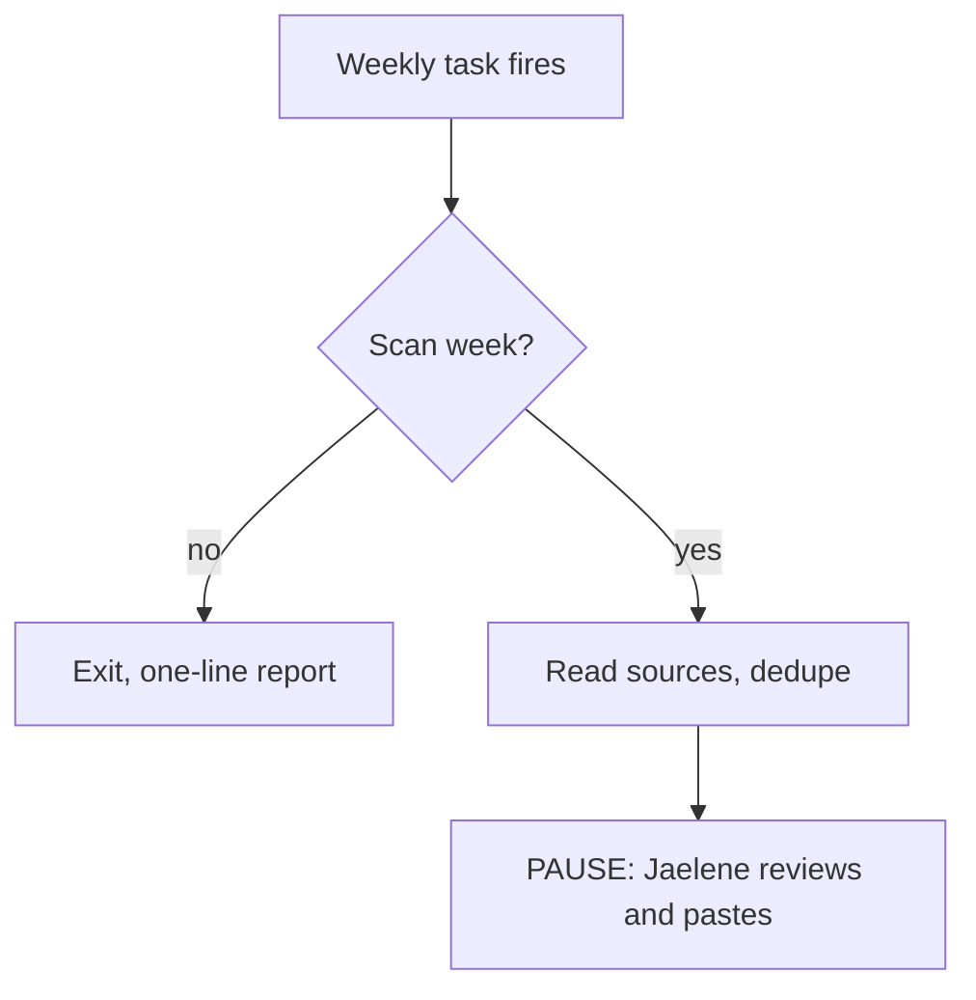

> Apply the current [pipeline contract](../../agent-structure/references/pipeline.md) first. It defines the proportional evidence profile and manifest handoff; historical examples below do not override it.

## Diagrams

Every PRD carries **two** diagrams. A third only if the design genuinely branches.

1. **Run sequence** — the Gate 1B table as a flow, with pauses visually distinct. This
   is the one people look at first and often the only one they look at.
2. **Systems map** — every external system as a node, with arrows labelled `read` or
   `write`. Direction matters more than layout here: an arrow you cannot draw because
   the connector cannot write is a design problem found early rather than late.
3. **Decision logic** — only where a step branches on content. Skip it for linear flows;
   a diagram of a straight line teaches nobody anything.

One diagram per job where there are several jobs. Do not draw one diagram containing
three unrelated flows.

### Rendering

**In a document (case 1), diagrams must be rendered images. Never ASCII art in a
`.docx` or `.pdf`** — it reads as unfinished, and it is the single most common reason
these documents get ignored by the people they were written for.

**Use Graphviz via the Python `graphviz` package.** It renders headless and is reliably
present. **Do not reach for `mermaid-cli`** — it needs a bundled Chromium that is
usually absent, and it fails at the last step after the document is otherwise built.
Check availability before committing to a toolchain, and fall back to Graphviz.

```python
from graphviz import Digraph

INK, ACCENT, LINE = "#382829", "#C85C35", "#D8D2CF"
g = Digraph(format="png")
g.attr(rankdir="TB", bgcolor="transparent", splines="polyline",
       nodesep="0.35", ranksep="0.45")
g.attr("node", shape="box", style="rounded,filled", fillcolor="#FAF9F8",
       color=LINE, fontname="Helvetica", fontsize="11", fontcolor=INK,
       margin="0.20,0.12", penwidth="1.2")
g.attr("edge", color=INK, arrowsize="0.7", penwidth="1.1",
       fontname="Helvetica", fontsize="9")

g.node("t", "Weekly task fires")
g.node("q", "Scan week?", shape="diamond", fillcolor="#FFFFFF")
g.node("x", "Exit — one-line report")
g.node("r", "Read sources, dedupe")
# pause nodes carry the accent colour and a heavier border
g.node("p", "PAUSE — Jaelene\nreviews and pastes",
       fillcolor="#F7E9E3", color=ACCENT, penwidth="2")

g.edge("t", "q"); g.edge("q", "x", label=" no ")
g.edge("q", "r", label=" yes "); g.edge("r", "p")
g.render("run-sequence", cleanup=True)   # -> run-sequence.png
```

**Conventions to hold to:**

- **Pause nodes are visually distinct** — accent fill and a heavier border. A reader
  should be able to find every human touchpoint without reading a word.
- **Diamonds for decisions**, boxes for steps. Label the branches.
- `splines="polyline"`, not `"ortho"` — orthogonal edges silently drop edge labels.
- **Left-to-right (`rankdir="LR"`) for systems maps**, top-to-bottom for sequences.
- Sanity-check the file exists and has a plausible size before embedding it. A
  zero-byte image in a delivered document is worse than no image.

**In cases 2 and 3**, emit Mermaid fenced blocks instead — they render in most IDE
previews and in chat, and they stay diffable in version control:

````

````

---

