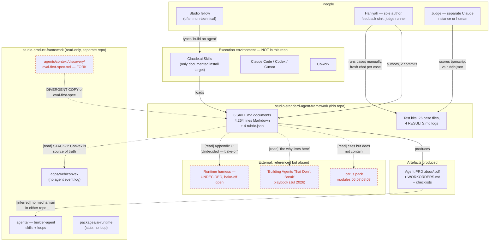
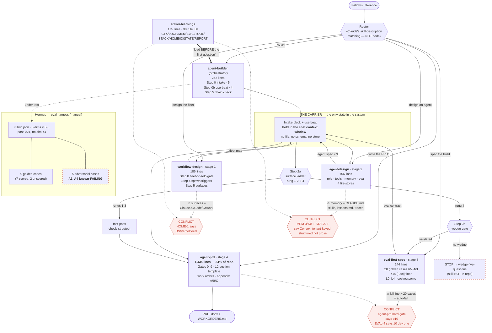

# studio-standard-agent-framework — architecture as it exists today

**Method note.** The prompt asked for the `architecture-map` approach
(https://www.skills.sh/almendili/skills/architecture-map). I fetched it. It is a repo→isometric-city
visualiser whose core rule is *"Prose, groups and flows are authored. Counts, coverage and geometry are
measured"* — buildings sized by **code weight**, lines drawn from **call paths that genuinely exist**.

It is not unavailable; it is **inapplicable**. The target repo contains 48 files, all Markdown/JSON, and
**zero executable code**: no functions, no imports, no call graph, no runtime. There is nothing to measure
and no call paths to trace. Applying it would produce a city of 48 identical document-shaped buildings
connected by lines I invented. Per the "do not invent" rule, I used Mermaid instead, and every edge below
is labelled with how I know it exists.

**Edge provenance key**
- `[read]` — I read the file and the reference is literally in the text.
- `[inferred]` — not stated in the repo; deduced from surrounding text. Marked individually.

---

## Level 1 — System context

**What this level shows.** The framework's only *implemented* consumer surface is Claude.ai Skills
(README: "Claude.ai → Settings → Capabilities → Skills → Add"). Every other relationship on this diagram
is a document reference, not a wire. The three red dashed nodes are load-bearing dependencies that live
outside the repo, and one of them (`eval-first-spec`) has already forked.

---

## Level 2 — Component view: the chain, its state, and its contradictions

**What this level shows.**

1. **There is no dependency graph, because there are no dependencies.** Six independent Markdown files.
   "Chaining" is Claude reading one file that tells it to behave as if it had read another. Nothing
   imports, resolves, or version-pins anything. The arrows are *intentions expressed in prose*.

2. **The carrier is the whole state layer, and it is a context window.** `agent-builder` calls it "the
   carrier" and says stages read from it so nothing is re-asked. It has no file, no schema, no
   serialisation, no persistence. A closed tab loses the entire chain — which the framework's own
   `LOOP-2` ("durable, append-only event log outside the process") forbids. `G5` in the Hermes log was
   lost exactly this way: *"chat deleted before the rung ruling."*

3. **`agent-prd` is 34% of the corpus.** 1,435 of 4,264 lines in one file — 5.5× the orchestrator that
   calls it. Any edit to a shared concept (memory tiers, exit conditions, the rung ladder) has to be
   made there *and* in `atelier-learnings` *and* in `agent-builder`'s chain check.

4. **Three unreconciled contradictions**, each between a stage skill and the rules layer that is supposed
   to be law. `agent-builder` Step 5 explicitly reconciles three shared rules (memory vocabulary,
   generator≠evaluator, kill line) — but not these.

---

## Where the diagram is guessing

- The edge `Agent PRD → studio-product-framework` is `[inferred]`. No file in either repo describes how a
  produced PRD becomes a work item, a repo, or a Convex deployment. There is no handoff mechanism.
- The router node is drawn as a component. It is not one. It is Claude's own skill-selection behaviour
  matching against the `description:` frontmatter. The repo has no routing code, and the Hermes cases
  confirm it is non-deterministic (A5: a loaded sibling changes routing).
- `Icarus modules 06/07/08/03` are cited by number in five places; I have not read them and they are not
  in this repo.
